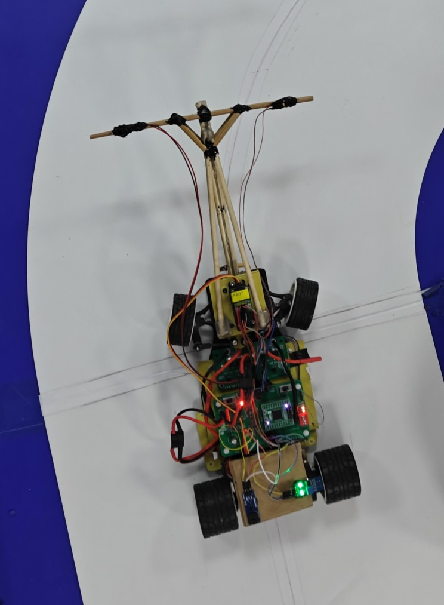

> I dedicate this post to the nearly two months spent on the on-campus competition, to the hard work and collaboration shared with my teammates, and to the university's Intelligent Transportation Lab for their generous help and guidance.



Here's our humble little car on the track.

:::note
If you're not into embedded systems, feel free to skim or [skip](/posts/building-nutshell#behind-nutshell) ahead.
:::

## Setup

::github{repo="pstron/nutshell"}

This [repository](https://github.com/pstron/nutshell) hosts the open-source firmware for the `Nutshell` project, which drives our car to follow a track using electromagnetic sensing.

For a basic toolchain setup, you can refer to my [previous post](/posts/stm32-development-setup-on-linux).

To get started, clone the repository:

```bash
git clone https://github.com/pstron/nutshell.git
````

## Exploring the Code

The hardware pins are configured using `STM32CubeMX`. You can open `nutshell.ioc` in CubeMX to inspect or modify the configuration.

The main application is written in C++, which allows for modular design using classes and leverages the C++ standard library for efficient and clean code.

The following sections will help you navigate the code structure and understand the purpose of each module.

### ScheduledTask

In `Core/Inc/ScheduledTask.h`, the `ScheduledTask` class provides a framework for running multiple tasks independently at different time intervals. It forms the foundation for implementing more complex control logic.

To use it, include the header:

```cpp
#include "ScheduledTask.h"
```

Then initialize a scheduler:

```cpp
Scheduler scheduler(start_tick);
```

Tasks can be added like this:

```cpp
scheduler.addTaskAndInit(
  makeStepTask<2>(2000, [](Device& dev, size_t step){
    dev.light(step);
  })
);
```

The scheduler supports features such as start delays, step division, and limiting the maximum number of runs for each task.

### Device

The `Device` class, defined in `Core/Inc/Device.h` and implemented in `Core/Src/Device.cpp`, abstracts hardware interactions, allowing control logic to be written naturally without dealing with low-level details.

Example functions include:

```cpp
// Basic operations
void delay(uint32_t ms);
uint32_t getTick();
void setLightMode(LightMode mode);
LightMode getLightMode();
// Lighting
void light(LightMode mode, uint8_t x);
void forceLight(uint8_t id, bool light);
void forceLight(uint8_t x);
// Buzzer
void buzz(bool enabled);
// Music
void playNote(Melody::Note note);
void playLight(bool set);
// Switches
uint8_t switchStatus();
bool switchOn(SwitchID id);
// Other I/O
bool isEnabled();
bool getStopSignal();
bool getIRSignal();
uint16_t getNoseADC(NoseID id, bool enableFiltering = false);
void setDirection(int32_t rotation);
void setMotorEnabled(bool enabled);
void setPower(int32_t power);
// Debugging
void sendData(float a, float b);
void sendData(const std::vector<float>& datas);
void sendDataSafely(const std::vector<float>& datas);
```

You can initialize a `Device` object as follows:

```cpp
Device device;
```

Then use its member functions to implement control logic for sensors, motors, and other hardware modules.

### App

In `Core/Inc/App.h`, the `App()` function is exposed to `Core/Src/main.c`. This allows `main.c` to remain minimal, simply calling `App()` to start the program. All application logic resides in `Core/Src/App.cpp`.

Example structure of `App.cpp`:

```cpp
#include "App.h"
#include "Device.h"
#include "ScheduledTask.h"
// Other includes

struct {
  // Configuration parameters
} Config;

// Other global variables

void App() {
  Device device;

  // Capture the initial tick to initialize tasks
  uint32_t start_tick = device.getTick();

  Scheduler scheduler(start_tick);

  // Example task
  auto exampleTaskID = scheduler.addTaskAndInit(
    makeStepTask<2>(2000, [](Device& dev, size_t step){
      dev.light(step);
    })
  );

  // More tasks...

  // Main loop
  while (1) {
    uint32_t now = device.getTick();
    scheduler.runOnce(device, now);
    device.delay(1);
  }
}
```

Tasks cover I/O handling, module enabling, data collection and processing, as well as steering and speed control. There is even a task that plays melodies.

### Melodies

Yes, full melodies are implemented in the code!

In `Core/Inc/Melodies.h`, I defined note frequencies and included simplified melodies from [NES Super Mario Bros](https://www.zophar.net/music/nintendo-nes-nsf/super-mario-bros.html). These were adapted to play through a single passive buzzer. With appropriate task scheduling and accurate note timing, the classic tunes can be heard directly from the car.

### Buffer

To support more advanced data processing, a simple circular buffer is implemented in `Core/Inc/Buffer.h`.

### Conclusion

The Nutshell modules provide a clean and modular foundation for the car's control logic. `ScheduledTask` handles timed tasks, `Device` abstracts hardware interactions, and `App` orchestrates the overall program flow. This structure simplifies the implementation of complex behaviors such as speed control, steering, and data processing, while also making it easy to extend the system with new features - like melodies or additional sensors - in the future.

## Behind Nutshell

My journey began with an ordinary encounter. On my way home, I came across a fascinating robot and stopped to take a look. That simple moment led me to an online group where I learned about the Intelligent Transportation Lab.

I was drawn in by their technical prowess and impressive track record in numerous prestigious competitions. At the time, I was feeling lost and uncertain about my future, so I decided to give it a try and actively threw myself into the lab's activities. This eventually led me to form the NUT-Shell team for an on-campus competition. We collaborated closely, debating ideas and joining carnivals, info sessions, and evaluations.

There's a rather amusing part to this. Driven by immense ambition and confidence in my own technical abilities, I was eager to recruit more talent. Although the standard team size was five, we somehow formed a colossal alliance of twenty members - the entity we called "NUT." But when the on-campus competition began, the reality set in, and we ultimately had to compete as separate, smaller teams. Our grand vision slowly faded, and the bonds within that large group naturally loosened over time.

Back then, I devoted all my time to writing code and tinkering with parameters, full of passion and conviction. But I was in for a rude awakening. I realized that being good at programming in general didn't mean I could write a good control program. In that domain, I was starting from square one - a total beginner.

Unsurprisingly, our performance in the first routine race was a major letdown. The setback caused the initial passion within the team to fizzle out quickly, and honestly, my own drive and spirit were crushed.

But that initial defeat lit a fire under us. Instead of giving up, we channeled our frustration into relentless effort. The team left no stone unturned, meticulously overhauling the car's mechanics and hardware. I dove headfirst into embedded systems, teaching myself at a breakneck pace and rewriting the codebase in C++. Key architectures like the `ScheduledTask` module were born during this period of intense learning. We added countless patches through trial and error. So when our car - clunky as it was - finally completed a stable lap in the next routine race, it felt like a hard-won victory.

The breakthrough gave us a thrilling boost, pushing us into an enduring phase of tireless tuning and refinement. Our focus eventually narrowed to a segmented PID approach, and we painstakingly refined each parameter. Our efforts paid off when we clinched fifth place in the subsequent routine race, leaving the entire team exhilarated.

Looking back, these memories remain etched deeply in my mind. As I write this, whenever I close my eyes, I seem to return to those moments in an instant. It might be the sudden surge of joy when I was sitting by the track, watching our car always overshoot a turn before abruptly correcting, only to realize I'd miswritten an expression - and then seeing it take the curve smoothly after fixing the bug. Or perhaps it was the mix of exasperation and amusement after hours of frantic troubleshooting, finally discovering that a teammate had set the DIP switches wrong. Or maybe it's just one line echoing in my ears:  
"Did you see that?! Now it's running great!"

What followed, however, was the wall. We kept pouring time and energy into the car, but our progress flatlined. Minor issues snowballed, and my own motivation was fraying. The code we had inherited was a tangled mess - a labyrinth where finding bugs felt impossible. Have we already reached the limits of our abilities? Watching other teams speed ahead while we struggled with basic reliability was deeply discouraging. Yet, beyond the frustration, my enthusiasm had faded too, because I no longer saw myself in it. My own path was coming into focus, and I realized something crucial: the smart car competition wasn't it. It just...wasn't. I stayed out of a sense of obligation to the team, a competitive drive, or perhaps some lingering attachment. So I kept showing up, helping to tune the car, all while feeling a deep, growing hopelessness.

Our performance in the competitions never really improved. We became what you might call a "gatekeeper" team - consistently the last among the relatively strong contenders. Divisions began to appear. I can't say who was right or wrong, but I strongly disagreed with my teammates' approach to parameter tuning. I wanted to experiment with new strategies, but my ideas were dismissed as unrealistic. The prevailing belief was that a new approach couldn't possibly match the performance of the old one in such a short time frame. We were completely stuck.

The list of unresolved issues loomed larger than ever, while our time and enthusiasm kept slipping away. I must admit: I was never meant for a contest like this. We gave up. Perhaps that was a sign of weakness - turning what could have been a decent situation into a lingering regret. Or perhaps it was a rational choice for us, freeing up our energy for other pursuits. I still don't know how to judge it, but the truth is, we never returned to tune the car again.

For the last routine race, we went through the motions, only to be eliminated in the first round. Still, thanks to our earlier results and the expanded number of participating teams, we managed to qualify for the finals. By then, I had nearly lost all interest, but my teammate said, "I hope we can finish what we started."

I agreed.

So, no matter what had happened before, we returned for the finals - to let our little car take the Last Dance on the final track, and to perform one last melody. It ran steadily, handled every turn as it should, and stopped in the right position. It was just too slow - almost ten seconds behind the opponent.

And so, our team was eventually eliminated. A graceful goodbye, however, is never easy.

This is why I'm writing this down - to preserve this chapter of my life, flawed, real, and full of meaning.

I need to remember every incredible teammate.

I need to remember all the generous help and patient guidance I was given.

I need to remember the hard-won lessons.

I need to remember it all: the imperfect, yet truly remarkable, adventure.

And if this open-source project or my experience can help you go even a little further, then that makes all of it worthwhile.

