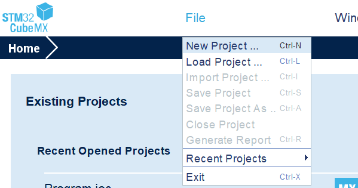
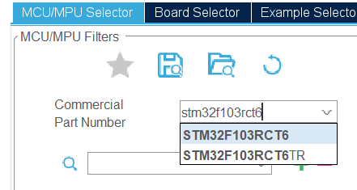
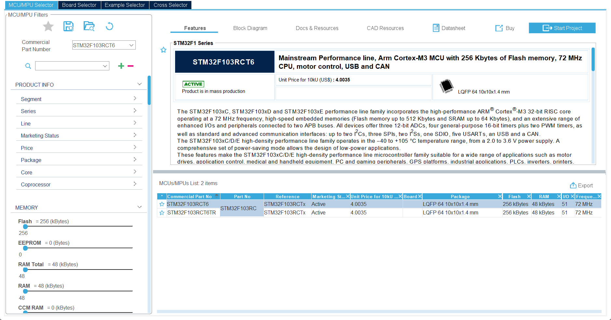
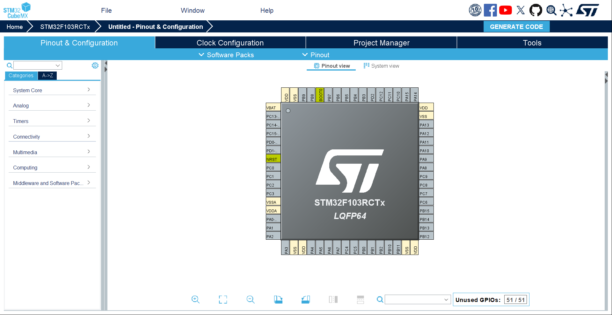
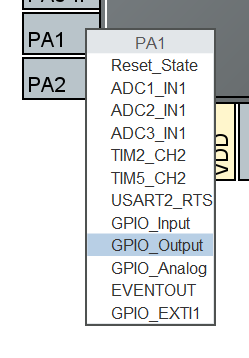
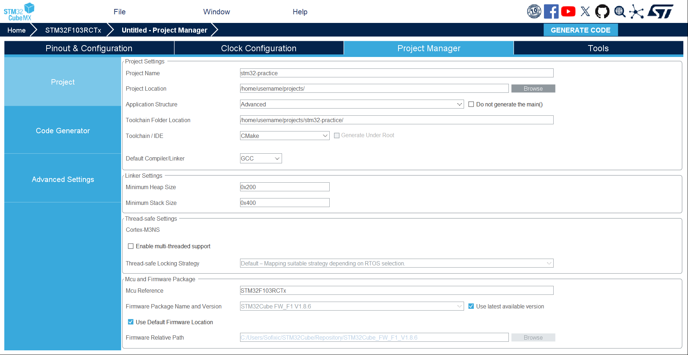
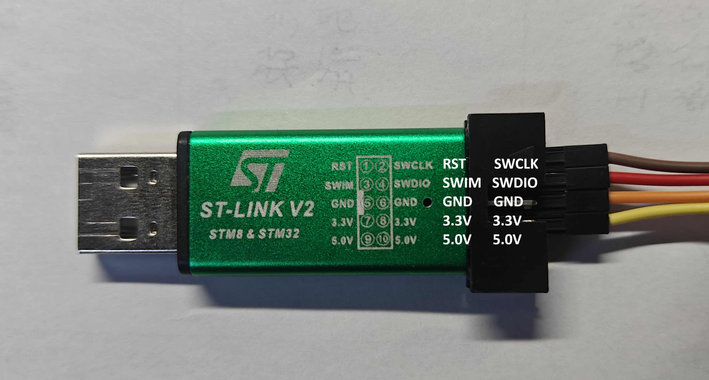
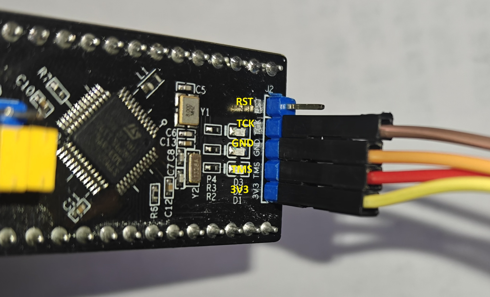

This post walks through setting up STM32 development environment on Arch Linux and will guide you to blink a LED with C++.

## Materials you need

Besides a PC, you will also need a STM32 board to run programs and a STLink or other tools to flash programs.

If you want to reproduce the blink project, you may also need jumper wires, a breadboard, resistors, and an LED.

## Install necessary packages

Install toolchain for building, compiling and flashing STM32 programs.

```bash
sudo pacman -S arm-none-eabi-gcc arm-none-eabi-newlib arm-none-eabi-binutils stlink openocd gdb-arm-none-eabi cmake ninja clangd
```

Install `stm32cubemx` for project configuration and generation.

```bash
paru -S stm32cubemx
```

## Create your project with STM32CubeMX

Launch STM32CubeMX, Click `File - New Project` to create a new project,



and input your board's `Commercial Part Number` to search for your MCU,



for example, I used `stm32f103rct6`.

Then choose the right one and click `Start Project`.



Your STM32CubeMX should display some information like this.

Now you can see a diagram of your MCU's pinout, and therefore you can config them conveniently.



For example, since we want to blink an LED, I choose to use `PA1` because there is an LED on my board connected with it. You can choose a proper one for your situation. Now you can click on the pin in the diagram and select `GPIO_Output` in the popup menu to use it as a GPIO output.



Then you can right click it and click `Enter User Lable`,


and input `LED_1`. A user lable will help you get a clear definition in your code generated in the project and therefore you can use it conveniently.


After completing configuration, go to the `Project Manager` tab, fill in the basic information including `Project Name`, `Project Location`. Then choose `CMake` as your `Toolchain/IDE`. Here we just keep the `Default Compiler/Linker` as `GCC`. Now go to the `Code Generator` section, set `Generate peripheral initialization as a pair of '.c/.h' files per peripheral` to true.




If you set everything correctly, your interface should be similar to the screenshots.

Once everything is configured, you can click `GENERATE CODE` button and generate your project. Then you can use `Neovim` to open the project and start coding.

## Enable C++

If you, like me, are a C++ fan or feel it sick to use C to build a complex project, you may want to enable C++. Fortunately, here's the way:

```bash
cd /path/to/your/project/
nvim CMakeLists.txt
```

Add these:

```cmake title="CMakeLists.txt"
#...
set(CMAKE_CXX_STANDARD 20)
set(CMAKE_CXX_STANDARD_REQUIRED ON)
set(CMAKE_CXX_EXTENSIONS OFF)
#...
enable_language(C CXX ASM) # Add CXX here
#...
target_sources(${CMAKE_PROJECT_NAME} PRIVATE
    #...
    Core/Src/App.cpp # Add your cpp sources here
    Core/Src/Device.cpp
)
#...
```

And config your `clangd` to avoid some problems:

```bash
nvim .clangd
```

```txt title=".clangd"
CompileFlags:
  CompilationDatabase: build
  Add:
    - -std=c++20
    - --target=arm-none-eabi
    - -mcpu=cortex-m3
    - -DSTM32F103xE
    - -fno-rtti
    - -fno-exceptions
    - -fno-threadsafe-statics
    # project headers 
    - -ICore/Inc
    - -IDrivers/STM32F1xx_HAL_Driver/Inc
    - -IDrivers/CMSIS/Device/ST/STM32F1xx/Include
    # toolchain C++ headers
    - -isystem
    - /usr/arm-none-eabi/include/c++/14.2.0
    - -isystem
    - /usr/arm-none-eabi/include/c++/14.2.0/arm-none-eabi
    - -isystem
    - /usr/arm-none-eabi/include/c++/14.2.0/backward
    - -isystem
    - /usr/lib/gcc/arm-none-eabi/14.2.0/include
    - -isystem
    - /usr/lib/gcc/arm-none-eabi/14.2.0/include-fixed
    - -isystem
    - /usr/arm-none-eabi/include
```

Note: This configuration is based on my personal setup. Some paths (especially toolchain and C++ standard library directories) may differ on your system, so please adjust them accordingly.

## Make a script to build automatically

```bash
nvim build.sh
chmod +x build.sh
```

Here's mine, you can use it freely. Remember to modify `PROJECT_NAME`, `INTERFACE_CFG`, `TARGET_CFG` variables' value to yours.

```bash title="build.sh"
#!/bin/bash

# Required Packages:
# arm-none-eabi-gcc
# arm-none-eabi-newlib
# arm-none-eabi-binutils
# cmake ninja
# stlink openocd
# gdb-arm-none-eabi

set -e

ROOT_DIR="$(cd "$(dirname "$0")" && pwd)"
BUILD_DIR="$ROOT_DIR/build"

TOOLCHAIN_FILE="$ROOT_DIR/cmake/gcc-arm-none-eabi.cmake"

# Customize these variables for your project
PROJECT_NAME="stm32-practice"
INTERFACE_CFG="interface/stlink.cfg"
TARGET_CFG="target/stm32f1x.cfg"

# Color definitions (pacman style)
RED='\033[1;31m'
GREEN='\033[1;32m'
YELLOW='\033[1;33m'
BLUE='\033[1;34m'
CYAN='\033[1;36m'
BOLD='\033[1m'
NC='\033[0m' # No Color

# Pacman-style output functions
print_action() {
    echo -e "${GREEN}::${NC} ${BOLD}$1${NC}"
}

print_progress() {
    echo -e "${BLUE}==>${NC} $1"
}

print_warning() {
    echo -e "${YELLOW}==> WARNING:${NC} $1"
}

print_error() {
    echo -e "${RED}==> ERROR:${NC} $1"
}

print_success() {
    echo -e "${GREEN}==> SUCCESS:${NC} $1"
}

print_info() {
    echo -e "${CYAN}==> INFO:${NC} $1"
}

# Function to build project
build_project() {
    local build_type=$1
    print_action "Building $build_type version..."

    mkdir -p "$BUILD_DIR"
    cd "$BUILD_DIR"

    print_progress "Running CMake..."
    cmake -G Ninja -DCMAKE_TOOLCHAIN_FILE="$TOOLCHAIN_FILE" -DCMAKE_BUILD_TYPE="$build_type" ..

    print_progress "Running Ninja..."
    ninja

    print_success "Build complete!"
}

# Function to flash the binary
flash_binary() {
    print_action "Flashing binary to device..."

    if [[ ! -f "${BUILD_DIR}/${PROJECT_NAME}.elf" ]]; then
        print_error "Binary not found. Please build first."
        exit 1
    fi

    print_progress "Starting OpenOCD..."
    openocd -f "$INTERFACE_CFG" -f "$TARGET_CFG" \
        -c "program ${BUILD_DIR}/${PROJECT_NAME}.elf verify reset exit"

    print_success "Flash complete!"
}

# Function to debug
debug_project() {
    print_action "Starting debug session..."

    if [[ ! -f "${BUILD_DIR}/${PROJECT_NAME}.elf" ]]; then
        print_error "Debug binary not found. Please build debug version first."
        exit 1
    fi

    print_progress "Starting OpenOCD daemon..."
    openocd -f "$INTERFACE_CFG" -f "$TARGET_CFG" &
    OCD_PID=$!

    sleep 1

    print_progress "Starting GDB session..."
    arm-none-eabi-gdb "${BUILD_DIR}/${PROJECT_NAME}.elf" \
        -ex "target remote :3333" \
        -ex "monitor reset halt" \
        -ex "layout src"

    # Clean up
    print_progress "Cleaning up..."
    kill $OCD_PID 2>/dev/null || true
    print_success "Debug session ended."
}

# Function to show build information
info_project() {
    print_action "Project Information"
    if [[ -f "${BUILD_DIR}/${PROJECT_NAME}.elf" ]]; then
        print_progress "Binary size information:"
        arm-none-eabi-size "${BUILD_DIR}/${PROJECT_NAME}.elf" | tail -n +2

        local build_type=$(grep CMAKE_BUILD_TYPE "${BUILD_DIR}/CMakeCache.txt" 2>/dev/null | cut -d= -f2 || echo "Unknown")
        print_info "Build type: $build_type"
        print_info "Binary location: ${BUILD_DIR}/${PROJECT_NAME}.elf"
    else
        print_warning "No binary found. Build the project first."
    fi
}

# Function to clean everything
clean_project() {
    print_action "Cleaning build directory..."
    if [[ -d "$BUILD_DIR" ]]; then
        rm -rf "$BUILD_DIR"
        print_success "Clean complete!"
    else
        print_warning "Build directory does not exist."
    fi
}

# Function to show status
status_project() {
    print_action "Project Status"
    if [[ -d "$BUILD_DIR" ]]; then
        print_info "Build directory exists: $BUILD_DIR"
        if [[ -f "${BUILD_DIR}/${PROJECT_NAME}.elf" ]]; then
            print_success "Binary exists: Yes"
            print_info "Last modified: $(stat -c %y "${BUILD_DIR}/${PROJECT_NAME}.elf" 2>/dev/null || echo "Unknown")"
            local build_type=$(grep CMAKE_BUILD_TYPE "${BUILD_DIR}/CMakeCache.txt" 2>/dev/null | cut -d= -f2 || echo "Unknown")
            print_info "Build type: $build_type"
        else
            print_warning "Binary does not exist"
        fi
    else
        print_warning "Build directory does not exist"
    fi
}

# Function to show help
show_help() {
    echo "Usage: $0 [OPTION]"
    echo ""
    echo "Main Options:"
    echo "  -S           Build Release version and flash (default)"
    echo "  -S[SUB]      Build with sub-options"
    echo "  -Q[SUB]      Query operations (status, info)"
    echo "  -D           Debug only (no build)"
    echo "  -C           Clean build directory"
    echo "  -h           Show this help message"
    echo ""
    echo "Sub-options for -S:"
    echo "  -Sr         Build Release only (no flash)"
    echo "  -Sd         Build Debug only (no flash)"
    echo "  -Sf         Flash only (no build)"
    echo "  -Sg         Build Release and flash (same as -S)"
    echo "  -Sdd        Build Debug and debug session"
    echo ""
    echo "Sub-options for -Q:"
    echo "  -Qs         Show project status"
    echo "  -Qi         Show build information"
    echo ""
    echo "Examples:"
    echo "  $0 -S       # Build Release and flash (default)"
    echo "  $0 -Sr      # Build Release only"
    echo "  $0 -Sd      # Build Debug only"
    echo "  $0 -Sf      # Flash only"
    echo "  $0 -Sdd     # Build Debug and debug"
    echo "  $0 -D       # Debug only (no build)"
    echo "  $0 -Qs      # Show status"
    echo "  $0 -Qi      # Show info"
    echo "  $0 -C       # Clean"
}

# Parse main options
case "${1:-"-S"}" in
    "-S")
        # Default: build Release and flash
        print_action "Build Release and flash"
        build_project "Release"
        flash_binary
        ;;
    "-Sr")
        print_action "Build Release only"
        build_project "Release"
        ;;
    "-Sd")
        print_action "Build Debug only"
        build_project "Debug"
        ;;
    "-Sf")
        print_action "Flash only"
        flash_binary
        ;;
    "-Sg")
        print_action "Build Release and flash"
        build_project "Release"
        flash_binary
        ;;
    "-Sdd")
        print_action "Build Debug and debug"
        build_project "Debug"
        debug_project
        ;;
    "-D")
        print_action "Debug only"
        debug_project
        ;;
    "-Qs")
        status_project
        ;;
    "-Qi")
        info_project
        ;;
    "-Q")
        # Default query: show status
        status_project
        ;;
    "-C")
        clean_project
        ;;
    "-h")
        show_help
        ;;
    *)
        print_error "Invalid option: $1"
        echo ""
        show_help
        exit 1
        ;;
esac
```

With the script, building, flashing and debugging(you need to learn how to debug with gdb) is extremely easy now:

```bash
./build -S      # Build release & Flash
./build -Sr     # Just build release version
./build -Sdd    # Build debug & Flash & Debug
```

## Make a blink

Everything is prepared. Why not make a blink project?

Add the following files step by step:

```cpp title="Core/Inc/App.h"
#pragma once

#ifdef __cplusplus
extern "C" {
#endif

#include <stdbool.h>

void App();

#ifdef __cplusplus
}
#endif
```

This provides the declaration of `App()` function where we will write our own applications, and it should be called by the main function in `main.c`.

```cpp title="Core/Inc/Device.h"
#pragma once
class Device {
public:
  void delay(uint32_t ms);
  uint32_t getTick();
  void light(uint8_t x);
private:
};
```

This provides the declaration of class `Device`, to provide interfaces to control our device. For now, it's very simple and has only some basic functions.

Now let's implement the definition:

```cpp title="Core/Src/Device.cpp"
#include <cstdint>
#include "stm32f1xx_hal.h"
#include "Device.h"
#include "main.h"

void Device::delay(uint32_t ms) {
  HAL_Delay(ms);
}

uint32_t Device::getTick() {
  return HAL_GetTick();
}

void Device::light(uint8_t x) {
  HAL_GPIO_WritePin(LED_1_GPIO_Port, LED_1_Pin, x & 0b1 ? GPIO_PIN_SET : GPIO_PIN_RESET);
}
```

Then we can write a simple program to blink the LED in the `App()` function:

```cpp title="Core/Src/App.cpp"
#include <cstdint>
#include "App.h"
#include "Device.h"

void App() {
  Device device;
  while (true) {
    device.light(0);
    device.delay(1000);
    device.light(1);
    device.delay(1000);
  }
}
```

And call it in the `main.c`:

```c title="Core/Src/main.c"
/* ... */
/* Private includes ----------------------------------------------------------*/
/* USER CODE BEGIN Includes */
#include "App.h"

/* USER CODE END Includes */
/* ... */
int main(void)
{
  /* ... */
  /* USER CODE BEGIN 2 */
  App();

  /* USER CODE END 2 */

  /* Infinite loop */
  /* USER CODE BEGIN WHILE */
  while (1)
  {
    /* USER CODE END WHILE */

    /* USER CODE BEGIN 3 */
  }
  /* USER CODE END 3 */
}
/* ... */
```

Now we've finished the coding part. You can `./build -Sr` to check whether you can build it normally or not. If you use my script, you will see `==> SUCCESS: Build complete!` if you build successfully.

## Flash and go

Connect to your board through STLink or other tools:





Make sure you connect the ports correctly. Now, use `./build -S` to build and flash the program to your board. If everything goes well, you will see the LED is blinking! Congratulations and welcome to the world of embedded development.
